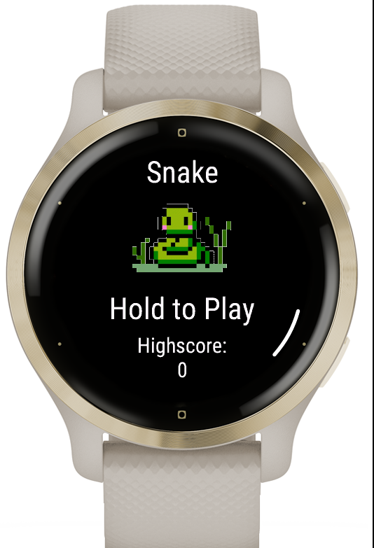
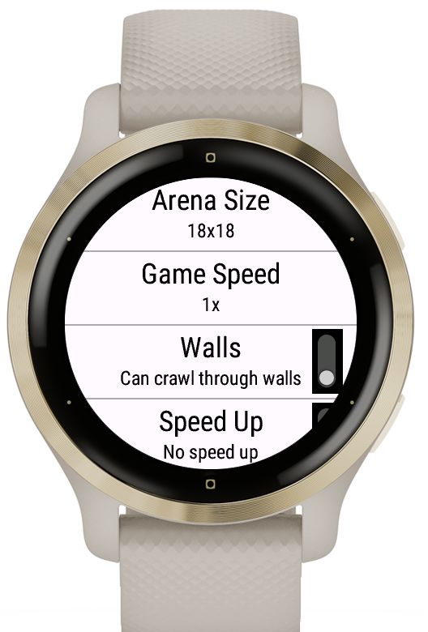
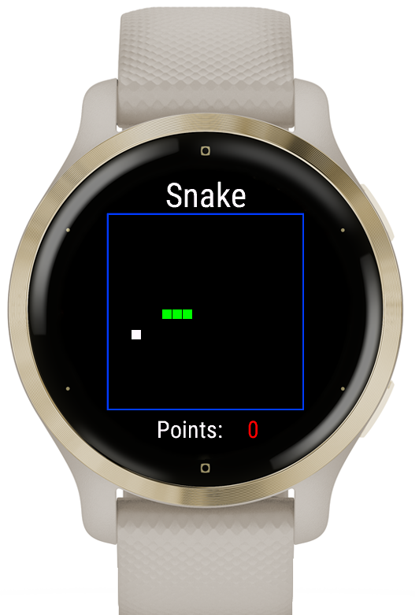
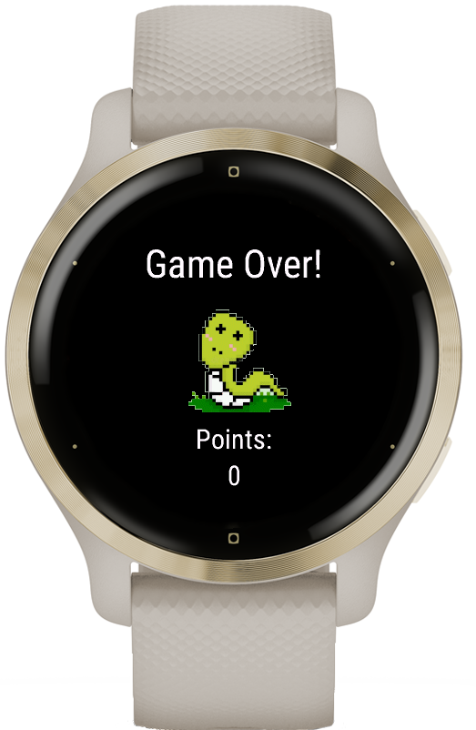

# Snake 2

Welcome to Snake 2, a modern take on the classic Snake game. This project is built using Monkey C.

## Features

- Classic snake gameplay
- Multiple board sizes
- Multiple other settings
- High score tracking

## Screenshots

Here are some screenshots of the game:

  

    <h3>Main Menu</h3>
    
  

  

    <h3>Settings</h3>
    
  

  

    <h3>Gameplay</h3>
    
  

  

    <h3>Game Over</h3>
    
  

## Installation

To run this project on your Garmin Venu 2S watch, download the release *.prg* file and copy it on the watch in the folder *GARMIN/APPS*.
To build it yourself, clone the repo and use the Garmin SDK to build the project.

## Contributing

Contributions are welcome! Please fork the repository and create a pull request with your changes.

## Contact

For any questions or feedback, please contact me here on GitHub.

Enjoy the game!
